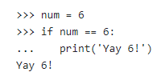
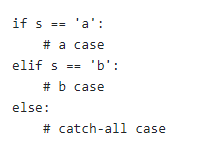

# Introduction to Python


## What is Python?
Python is a general purpose programming language for solving a variety of problems.

## What are some uses of python?
- Data Analysis
- Machine Learning and Artificial Intelligence
- Web Development
- Game Development
- Mobile and Desktop Applications
- Task Automation

## Companies using Python
- Google uses python in its web search system
- ESRI uses python as an end-user customization tool for its popular GIS mapping products
- Youtube is largely written in python. Same with Reddit, Pinterest and Instagram
- Companies like Uber, Goldman Sachs, Paypal, Netflix and Google require developers and data specialists to work with python.
- Intel, Cisco, HP, Seagate, Qualcomm, and IBM use python for hardware testing

## Algorithm vs Program
- An algorithm is an idea or a way to solve a problem
- A program is a sequence of instructions written so that a computer can perform certain tasks.


## Python Syntax
### Variables in Python
A python variable stores a value in memory as a program runs. A variable is created by an equal to assignment.
e.g. x = 4, creates a variable called x which stores a value called 4.


A python variable can be reassigned or swapped. Different variables can store the same values. 


### Math and expressions
- **Numbers**:There are two different types of numbers for arithmetic operations in python. These are "int" (e.g., 3, -4) for whole integer numbers and "float" (e.g. 2.45, -5.67) for decimal numbers.
- **Precedence**: Arithmetic operations in python follows the same precendence rules as in mathematics. Remember *BODMAS*!
- **Expressions**:
    - Division / yields float
    - Int Division // rounds to an integer
    - The ** operator does exponentiation
    - The "modulo" or "mod" operator is the remainder after division

     
### Print and Input
- The python print function `print()` takes in python data such as ints and strings and shows them in the terminal on one line of text. The items are converted to text form, separated by spaces.


- The input function `input()` allows us to take information from a particular user. That user information can further used in a program, or printed back to the user.


### If and Comparison
- The `if` statement controls if some lines run or not. The if statement syntax has four parts:
    - if
    - boolean test
    - colon
    - indented body lines

The simplest and most common boolean tests use `==` to compare two values and results in `True` if both values are the same, otherwise, it's `False`. Other operators like `>`, `<`, `>=`, `<=` can also be used.

The values `True` and `False` are known as Boolean values and have the data type "bool", short term for "boolean". They are usually used to control if and while loops.   The operators used in boolean tests can also be combined with the keywords `and`, `or` and `not`.These are known as logical operators. They help test for multiple conditions at the same time, or invert a boolean test(in the case of `not`).
These logical operators follow this precedence: `not` is the highest order, followed by `and` and finally `or`, similar to the precedence for the mathematical operators `-`, `*`, `+`.
Try these in your terminal: `9 < 6 and  3 < 6 or 2 < 6`,  `9 < 6 and  (3 < 6 or 2 < 6)`



- There's an optional `else:` part of an if statement that enables you to add code to run if the boolean test is `False`.

    ```py
    score = 97
    high_score = 91
    if score > high_score:
        message = "New High Score !"
    else:
        message = "Oh well!"
    ```

- We also use `elif` (else if) blocks in if statements when we need to evaluate more than two conditions and take various actions based on the boolean tests for each of those conditions. Think of them like nested if statements in excel.



### While and For Loops
A loop takes a few lines of code and runs them over and over again.
- **While Loops**: A while-loop uses a boolean test expression to control the run of a body of lines of code. We use a while-loop when we don't know the number of times to loop over a code, but we know the condition under which the code must be run(executed).
The while-loop syntax has four parts: `while`, boolean test, colon, indented body line.
```py
while test:
    indented body lines
```

### Functions
### Data Structures
- Lists
- Dictionaries
- Strings

## What is Pandas
### DataFrame Operations
- Read data
- operations and agregate functions
- groupby
- np.where with pandas