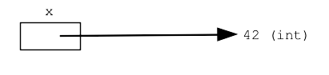

# Introduction to Python


## What is Python?
Python is a general purpose programming language for solving a variety of problems.

## What are some uses of python?
- Data Analysis
- Machine Learning and Artificial Intelligence
- Web Development
- Game Development
- Mobile and Desktop Applications
- Task Automation

## Companies using Python
- Google uses python in its web search system
- ESRI uses python as an end-user customization tool for its popular GIS mapping products
- Youtube is largely written in python. Same with Reddit, Pinterest and Instagram
- Companies like Uber, Goldman Sachs, Paypal, Netflix and Google require developers and data specialists to work with python.
- Intel, Cisco, HP, Seagate, Qualcomm, and IBM use python for hardware testing

## Algorithm vs Program
- An algorithm is an idea or a way to solve a problem
- A program is a sequence of instructions written so that a computer can perform certain tasks.


## Python Syntax

### **Variables in Python**
A python variable stores a value in memory as a program runs. A variable is created by an equal to assignment.
e.g. x = 4, creates a variable called x which stores a value called 4.



A python variable can be reassigned or swapped. Different variables can store the same values. 


### **Math and expressions**
- **Numbers**:There are two different types of numbers for arithmetic operations in python. These are "int" (e.g., 3, -4) for whole integer numbers and "float" (e.g. 2.45, -5.67) for decimal numbers.
- **Precedence**: Arithmetic operations in python follows the same precendence rules as in mathematics. Remember *BODMAS*!
- **Expressions**:
    - Division / yields float
    - Int Division // rounds to an integer
    - The ** operator does exponentiation
    - The "modulo" or "mod" operator is the remainder after division

     


### **Print and Input**
- The python print function `print()` takes in python data such as ints and strings and shows them in the terminal on one line of text. The items are converted to text form, separated by spaces.


- The input function `input()` allows us to take information from a particular user. That user information can further used in a program, or printed back to the user.


### **If and Comparison**
The `if` statement controls if some lines run or not. The if statement syntax has four parts:
- `if`
- boolean test
- colon
- indented body lines

    
```py
num = 6
if num == 6:
    print("Yay 6")
```

The simplest and most common boolean tests use `==` to compare two values and results in `True` if both values are the same, otherwise, it's `False`. Other operators like `>`, `<`, `>=`, `<=` can also be used.

The values `True` and `False` are known as Boolean values and have the data type "bool", short term for "boolean". They are usually used to control if and while loops.   The operators used in boolean tests can also be combined with the keywords `and`, `or` and `not`.These are known as logical operators. They help test for multiple conditions at the same time, or invert a boolean test(in the case of `not`).
These logical operators follow this precedence: `not` is the highest order, followed by `and` and finally `or`, similar to the precedence for the mathematical operators `-`, `*`, `+`.
Try these in your terminal: `9 < 6 and  3 < 6 or 2 < 6`,  `9 < 6 and  (3 < 6 or 2 < 6)`

- There's an optional `else:` part of an if statement that enables you to add code to run if the boolean test is `False`.

    ```py
    score = 97
    high_score = 91
    if score > high_score:
        message = "New High Score !"
    else:
        message = "Oh well!"
    ```

- We also use `elif` (else if) blocks in if statements when we need to evaluate more than two conditions and take various actions based on the boolean tests for each of those conditions. Think of them like nested if statements in excel.
    ```py
    s = 'e'
    if s == 'a':
        print("letter a")
    elif s == 'b':
        print("letter b")
    else:
        print("another letter")
    ```


### **While and For Loops**
A loop takes a few lines of code and runs them over and over again.

**While Loops**: A while-loop uses a boolean test expression to control the run of a body of lines of code. We use a while-loop when we want to run(execute) some lines of code as long as a certain condition is met, without explicitly stating the number of times we want to run those codes.
The while-loop syntax has four parts: `while`, boolean test, colon, indented body line.
```py
while test:
    indented body lines
```

The while operation checks the boolean test expression. If it evaluates to `True`, it runs all the indented body of lines from top to bottom. It then goes back to the boolean test, check it's value again, and so on. If the test is `False`, the loop stops, and the lines of code after the loops are run.

```py
i = 0
while i < 10:
    print(i)
    i = i + 1
print("All done")
```
Considerations:
- very often the last line of the while body act as an increment factor. It increases the variable used for the boolean test in order to advance it to the ultimate end of the loop.
- while loops can have zero iterations, and that's okay
- It's possible to write a loop that never exits. This happens when the boolean test is always true. It can also happen if the last increment line is eliminated.

**For Loops**: The for loop is the most commonly used of all loops. The for-loop, also known as the "for each" loop look at each element in a collection(for example, a list) once.
```py
for num in [2, 4, 6, 8]:
    print(num)
```
The loop begins with the keyword `for` followed by a variable(in this example `num`) to use in the loop. This is followed by the keyword `in` and a collection of elements for the loop(in this example `[2, 4, 6, 8]`). After this, there is a colon(`:`) followed by the indented body lines.
The loop runs the body of lines again and again for each member of the collection.

The python `range()` function can be used to create a collection of numbers on the fly. For example `range(10)` gives a collection of numbers starting from 0 ending at 9. `range(3, 8)` gives a collection of numbers starting from 3 ending at 7. 
```py
for i in range(6):
    print(6)
```

### Functions
Functions help us divide lines of codes into sensible sub-parts. Functions are written to carry out a specific task and can be used repeatedly when needed.
There are three main types of functions:
- Built-in functions such as `print()`, `range()`, `min()`, `max()`, etc.
- User-defined functions, which are functions users create to help them perform specific tasks
- Anonymous or lambda functions, which are functions which are declared without the standard `def` keyword.

Parts of a function definition:
- **def**: a function begins with the word `def`
- **name**: the function's name, chosen by the programmer
- **parenthesis**: a pair of parenthesis `()` follows the function name
- **body lines**: lines of code which makes up the function

Functions can take in optional arguments and return values. Function arguments helps us pass information into the functions, and can be any data type or structure. The return statement enables the function to send some information whenever the function is *called*.

To "call" a function is to invoke and run its lines of code. You call a function by typing the function's name followed by `()`. You supply the function with the needed parameters if the function has one.
 ```py
 def my_function(args):
     # body of lines
     return # some value

```
### Data Structures
**Lists**
A list contains series of any data type: strings, ints, other lists. Items inside a list are generally called elements.
Items in a list can be assessed by using identifiers known as "indexes".
- Indexing
- Operations: len, min, max
- Methods: append, pop, del, extend

**Dictionaries**
Dictionaries are used to store date in key:value pairs. Dictionaries are written in curly brackets. Dictionary items are ordered, changeables and does not allow duplicates.
Strings

## What is Pandas
### DataFrame Operations
- Read data
- operations and agregate functions
- groupby
- np.where with pandas